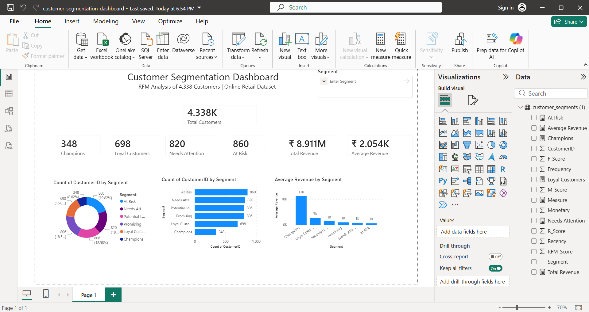

# Customer Segmentation Using RFM Analysis

## Overview

Performed customer segmentation using RFM (Recency, Frequency, Monetary) Analysis on an online retail dataset to identify high-value customers and generate business insights for customer retention and revenue growth.

## Tools Used

- Python
- Pandas
- Google Colab
- Power BI

## Dataset

- 397,884 retail transactions
- 4,338 customers

## Methodology

1. Data Cleaning and Preprocessing
2. Revenue Calculation
3. RFM Metric Generation
4. Customer Scoring
5. Customer Segmentation
6. Dashboard Development

## Customer Segments

| Segment | Customers |
|----------|----------:|
| Champions | 348 |
| Loyal Customers | 698 |
| Potential Loyalists | 806 |
| Promising | 806 |
| Needs Attention | 820 |
| At Risk | 860 |

## Key Insights

- Champions generated the highest average revenue (£11,221/customer)
- 860 customers were identified as At Risk
- 1,612 customers were classified as Potential Loyalists or Promising
- Customer segmentation enables targeted retention and marketing strategies

## Dashboard Preview



## Project Structure

```text
Customer-Segmentation-RFM
├── Dashboard
├── Dataset
├── Images
├── Python
└── README.md
```

## Files

- `RFM_Analysis.ipynb` → Python analysis notebook
- `customer_segments.csv` → Segmented customer dataset
- `customer_segmentation_dashboard.pbix` → Power BI dashboard
