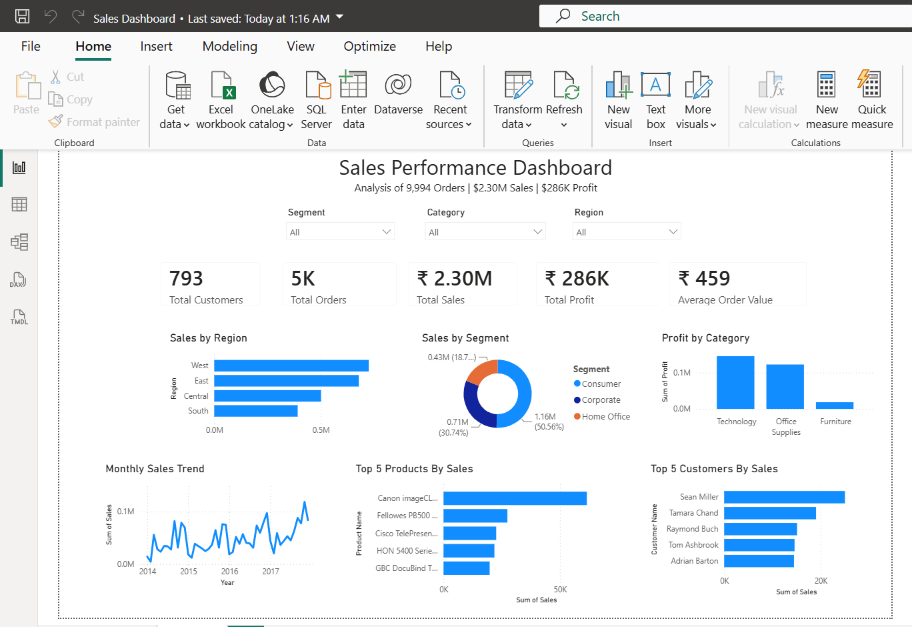

# Sales Performance Dashboard

## Overview

An interactive Power BI dashboard built using the Superstore dataset to analyze sales, profit, customers, products, and regional performance.

## Tools Used

- SQL Server Management Studio (SSMS)
- Power BI
- Excel

## Dashboard Preview



## Business Questions Answered

- Which region generates the highest sales?
- Which category generates the highest profit?
- Who are the top customers?
- Which products drive the most revenue?
- How do sales trend over time?

## Key Metrics

| Metric | Value |
|----------|----------|
| Total Sales | ₹2.30M |
| Total Profit | ₹286K |
| Total Orders | 5,009 |
| Total Customers | 793 |
| Average Order Value | ₹458.61 |

## Key Insights

- West region generated the highest sales.
- Technology category generated the highest profit.
- Consumer segment contributed over 50% of total sales.
- Canon imageCLASS was the highest-selling product.

## Project Structure

```text
Sales-Performance-Dashboard
│
├── Dashboard
├── Dataset
├── SQL
├── Images
└── README.md
```

## Files

- Dashboard/Sales_Dashboard.pbix
- Dataset/Superstore.csv
- SQL/Sales_Analysis.sql
